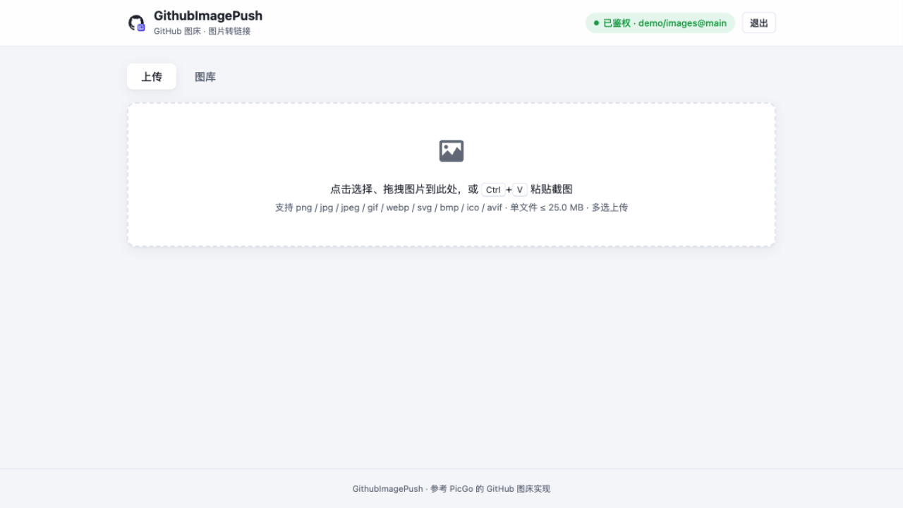
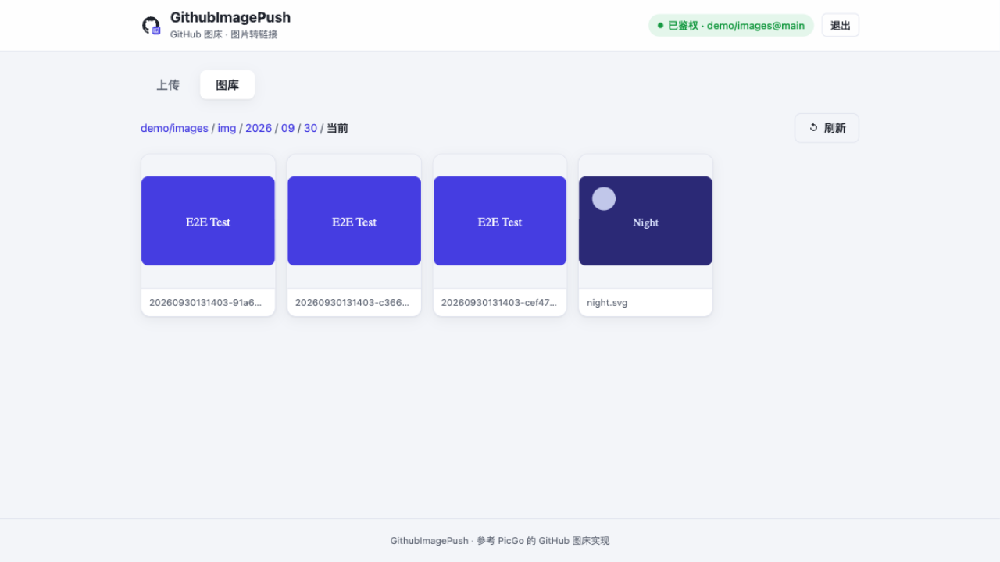
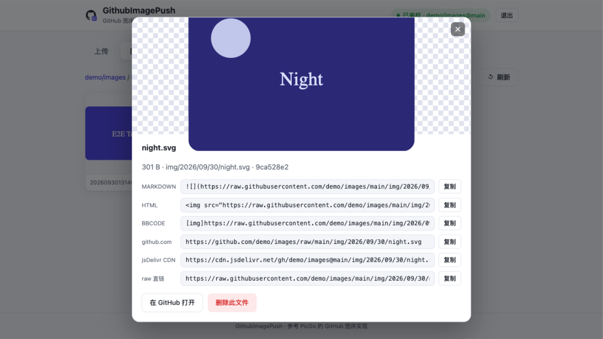

# GithubImagePush

[](https://github.com/JeckChen666/GithubImagePush/actions/workflows/ci.yml)
[](https://go.dev)
[](LICENSE)

把 GitHub 仓库当作免费图床的 Web 服务：上传图片，返回直链。**一个二进制同时提供 API 服务和 Web 页面**，上传方式参考 [PicGo](https://github.com/Molunerfinn/PicGo) 的 GitHub 图床实现（GitHub Contents API），并在其基础上增强了鉴权、图库管理、多链接格式等能力。

## 界面预览

| 上传（拖拽 / 多选 / Ctrl+V 粘贴） | 图库管理 |
| :---: | :---: |
|  |  |



> 截图为 `cmd/mockgh` 本地 Mock 模式下的演示数据，与真实仓库无关。

## 特性

- **单二进制**：Go 标准库 HTTP 服务，前端页面 `embed` 内嵌，无外部文件依赖，交叉编译即可部署
- **双形式访问**：
  - **API**：`Authorization: Bearer <key>` / `X-API-Key: <key>` / `?key=<key>` 三种携带方式
  - **网页**：页面右上角输入 Key 即可使用（存于浏览器 localStorage，不落服务端）
- **Key 由配置文件管理**：支持多 Key（方便分发与吊销），常量时间比较，按 IP 限速防暴力枚举
- **上传**：multipart 表单 / JSON base64（含 `data:image/png;base64,` 前缀）两种输入，多文件、进度条、粘贴（Ctrl+V）上传
- **链接格式**：`raw` / `jsdelivr` CDN / `github` / 自定义域名（支持 `{path}` 占位符，兼容 PicGo 的前缀拼接习惯），一次上传全部返回
- **图库管理**：目录导航、缩略图网格（私有仓库自动经服务端代理加载）、详情弹层（Markdown/HTML/BBCode/各格式链接复制）、删除
- **命名与冲突策略**：时间戳命名（默认，防同名）或保留原名；同名可报错（附已有链接）或覆盖
- **兼容 PicGo 生态**：`POST /upload` 输出 `{success, result: [...]}`，可直接配置到 PicGo/Typora 等的自定义 Web Uploader

## 快速开始

### 1. 准备 GitHub 仓库与 Token

1. 新建一个仓库（建议 Public，否则图片直链需要 token 才能访问）
2. 创建 Token：`Settings → Developer settings → Personal access tokens`
   - **Fine-grained token（推荐）**：仅授权目标仓库的 `Contents: Read and write`
   - **Classic token**：勾选 `repo` 权限

### 2. 配置并启动

```bash
cp config.example.yaml config.yaml
# 编辑 config.yaml：填写 token、repo、auth.keys

go build -o github-image-push .
./github-image-push            # 默认读取 ./config.yaml，监听 127.0.0.1:8080
```

浏览器打开 `http://127.0.0.1:8080`，输入 Key 即可使用。

命令行参数：

```bash
./github-image-push -config /path/to/config.yaml   # 指定配置文件
./github-image-push -addr 0.0.0.0:8080             # 覆盖监听地址
./github-image-push -version
```

### 3. 本地无 Token 体验（Mock 模式）

仓库附带一个内存态 GitHub API Mock，无需真实 token 即可完整体验上传/图库：

```bash
go run ./cmd/mockgh -addr 127.0.0.1:9999 -token goodtoken   # 终端 1
./github-image-push -config config.mock.yaml                # 终端 2，Key 为 demo-key-123
```

## API 一览

所有 `/api/*` 接口（除 `/healthz`）均需鉴权，响应统一为 `{"success": bool, "data"?: ..., "message"?: ...}`。

| 方法 | 路径 | 说明 |
|---|---|---|
| `POST` | `/api/upload` | 上传图片：multipart（任意带文件名的字段）或 JSON `{"filename","data"}` / `{"files":[{filename,data}...]} |
| `GET` | `/api/verify` | 校验 Key，返回服务端配置摘要 |
| `GET` | `/api/list?dir=` | 列出仓库目录（文件+子目录），带各格式链接 |
| `DELETE` | `/api/delete?path=` | 删除文件（自动获取 sha） |
| `GET` | `/api/raw?path=` | 服务端代理输出文件内容（私有仓库预览用） |
| `POST` | `/upload` | PicGo 自定义 Web Uploader 兼容别名，输出 `{success, result:[url...]}` |
| `GET` | `/healthz` | 健康检查（无需鉴权） |

### curl 示例

```bash
# multipart 上传
curl -H "X-API-Key: YOUR_KEY" -F "file=@./photo.png" http://127.0.0.1:8080/api/upload

# Bearer + JSON base64 上传
curl -H "Authorization: Bearer YOUR_KEY" -H "Content-Type: application/json" \
     -d '{"filename":"a.png","data":"'"$(base64 -i a.png)"'"}' \
     http://127.0.0.1:8080/api/upload

# 图库列表 / 删除
curl -H "X-API-Key: YOUR_KEY" "http://127.0.0.1:8080/api/list?dir=img"
curl -X DELETE -H "X-API-Key: YOUR_KEY" "http://127.0.0.1:8080/api/delete?path=img/2026/09/30/xxx.png"
```

上传响应示例（每个文件独立成败，`urls` 含全部格式）：

```json
{
  "success": true,
  "data": [{
    "name": "photo.png",
    "path": "img/2026/09/30/20260930152345-a1b2c3d4.png",
    "size": 12345,
    "url": "https://raw.githubusercontent.com/user/images/main/img/2026/09/30/20260930152345-a1b2c3d4.png",
    "urls": {
      "raw": "https://raw.githubusercontent.com/...",
      "jsdelivr": "https://cdn.jsdelivr.net/gh/user/images@main/img/...",
      "github": "https://github.com/user/images/raw/main/img/..."
    },
    "markdown": "",
    "html": "",
    "bbcode": "[img]...[/img]",
    "success": true
  }]
}
```

### 在 PicGo / Typora 中使用

安装 PicGo 的 `web-uploader` 类插件，配置：

- API 地址：`http://127.0.0.1:8080/upload`
- 请求头：`{"X-API-Key": "YOUR_KEY"}`

## 配置说明

完整带注释的配置见 [config.example.yaml](config.example.yaml)。要点：

| 配置 | 默认 | 说明 |
|---|---|---|
| `server.addr` | `127.0.0.1:8080` | 监听地址；对外服务改 `0.0.0.0:8080` 并注意配 HTTPS |
| `server.maxUploadSize` | 25MB | 单文件上限（GitHub Contents API 上限 100MB） |
| `auth.keys` | 必填 | 访问 Key 列表，至少一个 |
| `github.token` / `repo` / `branch` | 必填 | 图床仓库信息 |
| `github.path` + `pathTemplate` | `img` + `{year}/{month}/{day}` | 仓库内目录：`img/2026/09/30/xxx.png`；模板支持 `{year} {month} {day} {timestamp} {rand}` |
| `github.filenameStrategy` | `timestamp` | `timestamp`（防同名）/ `original`（保留原名） |
| `github.onConflict` | `error` | 同名已存在：`error`（返回报错+已有链接）/ `overwrite`（覆盖） |
| `github.urlFormat` | `raw` | 默认链接格式：`raw` / `jsdelivr` / `github` / `custom` |
| `github.customUrl` | 空 | 自定义域名，支持 `{path}` 占位符或前缀拼接 |
| `github.apiURL` | `https://api.github.com` | 可换反代地址或 GitHub Enterprise |

## 安全说明

- 所有数据接口都需要 Key；Key 校验使用常量时间比较
- 同一 IP 15 分钟内鉴权失败 12 次会被封禁 15 分钟
- `list` / `delete` / `raw` 的路径参数均做穿越清洗（`..`、前导 `/` 等被剔除）
- 上传有扩展名白名单与大小限制，请求体有总上限
- ⚠️ 生产环境对外暴露时请务必：使用强随机 Key、套 HTTPS（反向代理）、不要把 `config.yaml` 提交进仓库（`.gitignore` 已忽略）

## 与 PicGo 的差异

| 能力 | PicGo（GitHub 图床） | GithubImagePush |
|---|---|---|
| 形态 | 桌面客户端（Electron） | 单个 Web 服务端 |
| 鉴权 | 本地无鉴权 | Key 鉴权 + 限速 |
| 同名冲突 | 422 时直接拼 raw 链接返回（可能错图） | 时间戳命名避免冲突；原名模式可选报错/覆盖 |
| 图库管理 | 无（仅本地相册） | 目录导航 / 缩略图 / 删除（服务端直连 GitHub） |
| 私有仓库 | 网页无法预览 | 缩略图自动经 `/api/raw` 代理加载 |
| API | 本地 Server 无鉴权，格式固定 | 鉴权、多格式输出、PicGo 兼容别名 |

## 开发

```bash
go test ./...        # 单元测试（含 mock GitHub 全链路）
go vet ./... && gofmt -l .
go build -o github-image-push .
```

项目结构：

```
main.go                     # 入口：配置加载、HTTP 服务、优雅退出
internal/config/            # 配置加载与校验（YAML，兼容 JSON）
internal/githubx/           # GitHub Contents/Blobs API 客户端
internal/naming/            # 文件名清洗、路径模板、多格式链接生成
internal/server/            # 路由、鉴权中间件、handlers、内嵌前端
internal/server/web/        # 前端（原生 HTML/CSS/JS，无构建步骤）
internal/testutil/          # 内存态 GitHub API Mock
cmd/mockgh/                 # 独立启动 Mock 的工具（本地联调）
```

推 tag（如 `v1.0.0`）会触发 CI 自动构建全平台二进制并附到 GitHub Release（Linux/macOS/Windows，amd64/arm64）。

## License

[MIT](LICENSE) — 仅供学习与个人使用，请遵守 GitHub 服务条款，勿将仓库滥用于大文件存储。

